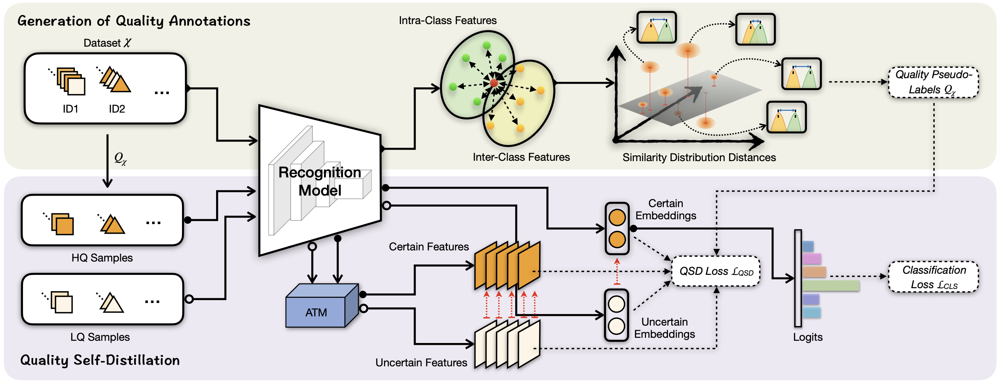

# Refining Uncertain Features with Self-Distillation for Face Recognition and Person Re-Identification

## Description
####
This is the code repository for the paper "Refining Uncertain Features with Self-Distillation for Face Recognition and Person Re-Identification," under the person re-identification (Re-ID) application on the [AGW](https://github.com/mangye16/ReID-Survey) baseline as an example.

## Abstract
####
Deep recognition models aim to recognize targets with various quality levels in uncontrolled application circumstances, and typically low-quality images usually retard the recognition performance dramatically. As such, a straightforward solution is to restore low-quality input images as pre-processing during deployment. However, this scheme cannot guarantee that deep recognition features of the processed images are conducive to recognition accuracy. How deep recognition features of low-quality images can be refined during training to optimize recognition models has largely escaped research attention in the field of metric learning. In this paper, we propose a quality-aware feature refinement framework based on the dedicated quality priors obtained according to the recognition performance, and a novel quality self-distillation algorithm to learn recognition models. We further show that the proposed scheme can significantly boost the performance of the recognition model with two popular deep recognition tasks, including face recognition and person re-identification. Extensive experimental results provide sufficient evidence on the effectiveness and impressive generalization capability of the proposed framework. Moreover, our framework can be essentially integrated with existing state-of-the-art classification loss functions and network architectures without extra computation costs during deployment. 


## Environment
The code is built on the PyTorch framework, and the explicit environment configuration can be referred to in the file './pytorch_environment.yml'.

## Training
1. **Dataset**: Please contact the creator of the relevant data set to obtain the right to use it. For the CUHK03 dataset, you may need to convert the ".mat" to ".png".
2. **Quality Annotations**: Obtain the quality annotations via [the code](https://github.com/Tencent/TFace/tree/quality/generate_pseudo_labels).
3. **Baseline Model**: The baseline AGW model can be downloaded from the official [Google Disk](https://drive.google.com/file/d/1Uyq_JBM2N1JL-buYWkLZFMd7N-eMjOUZ/view)
4. **QSD processing**: a). Modify the 'PRETRAIN_PATH' and 'QA_LABELS' parameters in the configuration file './configs/AGW_QSD.yml'; b). Run './main.py' to train the QSD model, where we also provide the training log in './log/log.txt' for your information. 

## Inference

1. You can download the QSD model trained on the CUHK03 dataset at the [Google Disk](https://drive.google.com/file/d/1lhNdtQ-tKvT3iXi9QbZGIATIYSRU8XA-/view).
2. Modify the 'EVALUATE_ONLY' and 'WEIGHT' parameters in the configuration file './configs/AGW_QSD.yml'.
3. Run './main.py'

## Models

- We also release different QSD models trained on other datasets. You can download the explicit checkpoint via the URL in the table below.

|   Datasets    | Rank-1 |  mAP  | mINP  |                             URL                              |
| :-----------: | :----: | :---: | :---: | :----------------------------------------------------------: |
|  Market1501   | 96.1%  | 88.7% | 66.8% | [Google Disk](https://drive.google.com/file/d/1tm0fLL8YLuRBILd4_qzKK3Jn_9RA8YG8/view?usp=drive_link) |
| DukeMTMC-reID | 89.4%  | 79.9% | 46.0% | [Google Disk](https://drive.google.com/file/d/17bKo4GbDe1GqwnCKfA8H84o9TGQO6NlP/view?usp=drive_link) |
|   MSMT17-V1   | 70.7%  | 52.3% | 16.6% | [Google Disk](https://drive.google.com/file/d/1ZiEcYZG0Znz5iMG2sOx5rtJwXNqDvUFa/view?usp=drive_link) |
|   MSMT17-V2   | 79.2%  | 56.4% | 13.6% | [Google Disk](https://drive.google.com/file/d/1UTZRi637MknOAdgMCcYvbhX3XHosuwQg/view?usp=drive_link) |

## Citing this Repository

If you find this code useful in your research, please consider citing us:
```
@ARTICLE{QSD2024,
  author={Ou, Fu-Zhao and Chen, Xingyu and Zhao, Kai and Wang, Shiqi and Wang, Yuan-Gen and Kwong, Sam},
  journal={IEEE Transactions on Multimedia}, 
  title={Refining Uncertain Features With Self-Distillation for Face Recognition and Person Re-Identification}, 
  year={2024},
  volume={26},
  pages={6981-6995},
  doi={10.1109/TMM.2024.3358697}}
}
```
